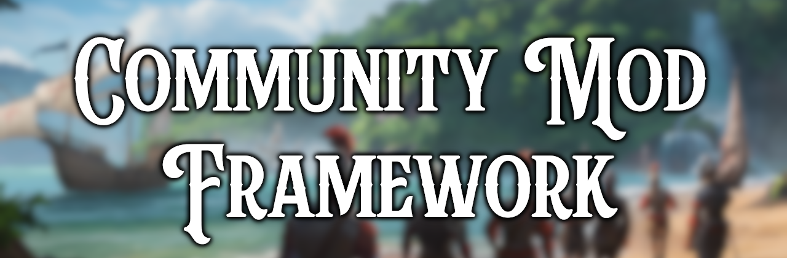

# Community Mod Framework

As the Community Mod Framework aims to support compatibility between different mods - sometimes you have to add something to it so your mods can integrate successfully.

# Philosophy

This framework aims to preserve base game behavior by default.
So if no other mod is used, the framework aims to be invisible to players.

The goal is to provide mods that make use of it, new ways to show content or hook into base game functionality.

## Contents
* [Ground Rules](#ground-rules)
* [File Naming](#file-naming)
* [Variable Prefixing](#variable-prefixing)
* [Community Engagement](#community-engagement)

## Ground Rules

As a *community* mod framework - we endeavor to make the bar to accessibility as low as we can make it without compromising functionality. However, please remember that we are all volunteers doing this for fun so please be respectful of our time.

## File Naming

CMF is designed to be (as much as possible) load-order agnostic - which means it doesn't matter where in a mod list it is loaded. As such, the way files are named is an important aspect of the framework's design.
File names control overwrite order (See the [Wiki](https://vic3.paradoxwikis.com/Mod_files_load_order) for more details.)

To ensure maximum robustness in compatibility design, it is important that universal receiver and universal provider content elements are not located in the same file as each other.

CMF universal providers should be named with either the `cmf_` prefix (for community files),
or with the vanilla-style file name prefixes like `00_`.

CMF universal receivers should be named with either a `ycmf_` prefix for general compatibility,
or some `zz_` style prefix if there is no justified reason for another mod to ever overwrite it.

Ensure that you know whether your files need to overwrite, or be overwritten, by CMF, and name them appropriately.

# Variable Prefixing

If you add a variable, list, effect, trigger, etc. for use in CMF, please prefix it using `cmf_`. This is to prevent conflicts with both base game and other mods.

It should be noted that, for functions which effectively add new features, we prefer generalized solutions which can be used by many different mods for consistent outcomes.

## Community Engagement

The absolute best place to connect with the project is via the Discord server: [Europa Universalis V](https://discord.gg/aUV49QbqYm)
