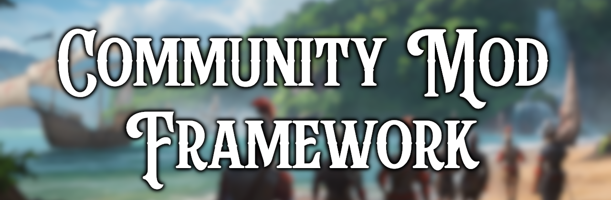

# Community Mod Framework (CMF)


A shared mod framework for **Europa Universalis 5**. Includes the Community Mod Menu (CMM), custom alerts, action bar elements, and more.

## Contents
* [Features](#features)
* [Getting Started](#getting-started)
* [Philosophy](#philosophy)
* [Contributors](#contributors)

## Steam Page
https://steamcommunity.com/sharedfiles/filedetails/?id=3692202776

## Features

- **[Community Mod Menu (CMM)](https://github.com/Europa-Universalis-5-Modding-Co-op/community-mod-framework/wiki/Community-Mod-Menu)** - Shared in-game settings UI for mods (toggles, sliders, dropdowns, buttons, text inputs, settings lists).
- **[CMM Visual Editor](https://github.com/Europa-Universalis-5-Modding-Co-op/community-mod-framework/wiki/CMM-Visual-Editor)** - Allows creating your mod menu from an interactive GUI application which generates all required files.
- **[Custom Alerts](https://github.com/Europa-Universalis-5-Modding-Co-op/community-mod-framework/wiki/Custom-Alerts)** - Dynamic, dismissable notifications in the in-game alert bar.
- **[Mod Banners](https://github.com/Europa-Universalis-5-Modding-Co-op/community-mod-framework/wiki/Mod-Banners)** - Display your mod as a banner on the pre-game lobby screen, with an icon, name, and description.
- **[Action Bar](https://github.com/Europa-Universalis-5-Modding-Co-op/community-mod-framework/wiki/Action-Bar)** - Custom action bar with configurable buttons.
- **[Mod Action Log](https://github.com/Europa-Universalis-5-Modding-Co-op/community-mod-framework/wiki/Mod-Action-Log)**: Global in-game log for recording mod actions with actor and arguments.
- **[is_host Trigger](https://github.com/Europa-Universalis-5-Modding-Co-op/community-mod-framework/wiki/is_host-Trigger)** - Check if the current country is controlled by the host player.
- **[Mod Detection](https://github.com/Europa-Universalis-5-Modding-Co-op/community-mod-framework/wiki/Mod-Detection)** - Check whether another mod is active with the cmf_is_mod_active trigger.
- **[On-Action Hooks](https://github.com/Europa-Universalis-5-Modding-Co-op/community-mod-framework/wiki/On-Action-Hooks)** - Post-lobby game start/load hooks, country transfer, and recurring yearly/monthly pulses for human players.
- **[Dependency Check Popup](https://github.com/Europa-Universalis-5-Modding-Co-op/community-mod-framework/wiki/Dependency-Check-Popup)** - Main menu popup that auto-enables CMF when missing.
- **[cmf_suppress Effect](https://github.com/Europa-Universalis-5-Modding-Co-op/community-mod-framework/wiki/Warning-Suppression)** - Suppress "used but never set" and "set but never used" engine warnings.
- **[GUI Macros](https://github.com/Europa-Universalis-5-Modding-Co-op/community-mod-framework/wiki/GUI-Macros)**: NAND, NOR, XOR logical operators.
- **[Improved Vanilla Top-Level Widget Overrides](https://github.com/Europa-Universalis-5-Modding-Co-op/community-mod-framework/wiki/Improved-Vanilla-Top-Level-Widget-Overrides)**: Extracted vanilla type and template definitions so your override only needs the top-level widget itself (lateralviews, topbar, outliner entries, etc.).
- **[Community Mod Toolkit (CMT)](https://github.com/Europa-Universalis-5-Modding-Co-op/community-mod-toolkit)** - A companion set of development tools, such as a mod template, workshop uploader and mod translator.

## Getting Started

To set this mod as a dependency to your own mod, you will need to add this to your `metadata.json` file:
```json
  "relationships" : [
    {
      "rel_type" : "dependency",
      "id" : "community_mod_framework",
      "display_name" : "Community Mod Framework",
      "resource_type" : "mod",
      "version" : "2.*"
    }
  ]
```
**Also remember to add the mod to your required items on your own mods steam page.**

See the [GitHub wiki](https://github.com/Europa-Universalis-5-Modding-Co-op/community-mod-framework/wiki) for full documentation on setting up and using each feature, or the [EU5 Paradox wiki](https://eu5.paradoxwikis.com/Community_Mod_Framework) which serves as quick reference.

# Philosophy

This framework aims to preserve base game behavior by default.
So if no other mod is used, the framework aims to be invisible to players.

The goal is to provide mods that make use of it, new ways to show content or hook into base game functionality.

## Links

- [Steam Workshop](https://steamcommunity.com/sharedfiles/filedetails/?id=3692202776)
- [Example Mod](https://github.com/Europa-Universalis-5-Modding-Co-op/community-mod-framework/tree/main/submods/cmf-example-mod)
- [Community Mod Toolkit](https://github.com/Europa-Universalis-5-Modding-Co-op/community-mod-toolkit)
- [Contributing](docs/CONTRIBUTING.md)
- [Discord](https://discord.gg/aqAAcCZsY7)

## Contributors
- [Bahmut](https://steamcommunity.com/id/Bahmut/)
- [CaesarVincens](https://steamcommunity.com/id/caesarvincens)
- [Conner](https://steamcommunity.com/id/ARealConner/)
- [Glorp](https://steamcommunity.com/id/clickypoo)
- [Pickle](https://steamcommunity.com/id/pickled-dev)
- [RomanImperator](https://steamcommunity.com/id/romaimperator)

## License

ISC. See [LICENSE](LICENSE).
