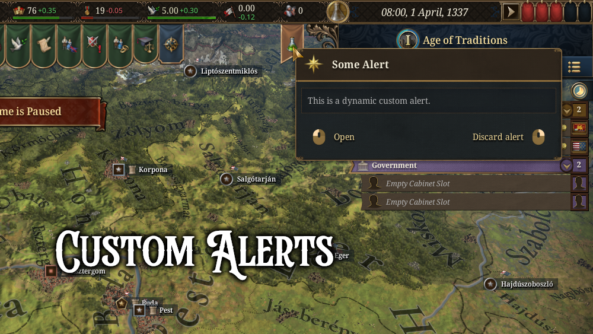
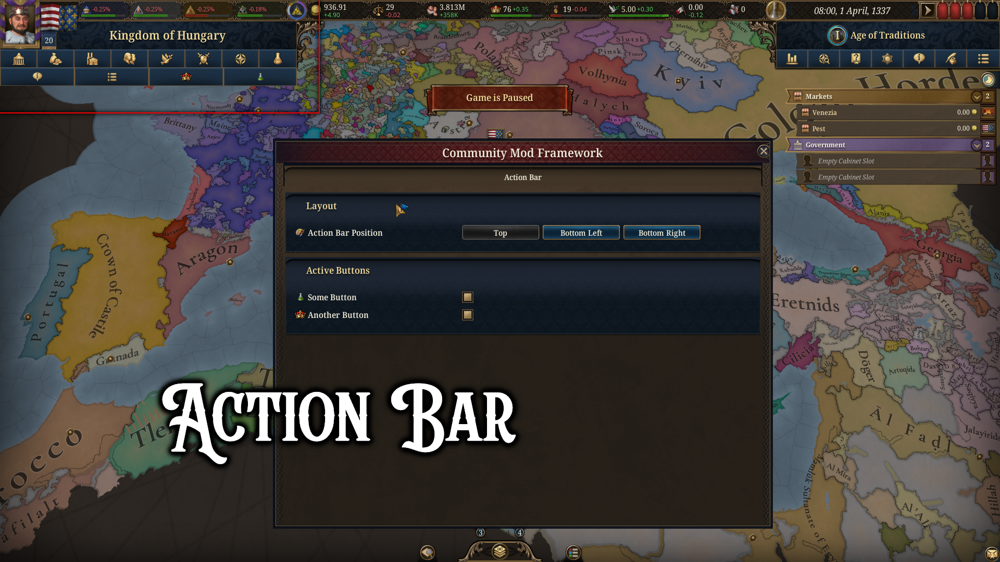
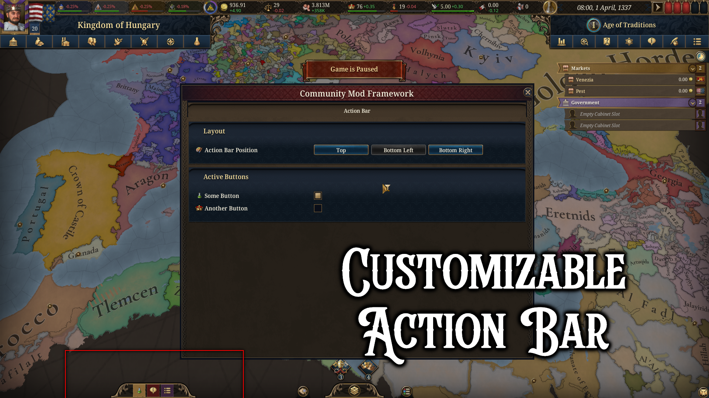

# Community Mod Framework (CMF)


A shared mod framework and menu for **Europa Universalis 5**. Includes the Community Mod Menu (CMM), custom alerts, action bar elements, and more.

## Steam Page
https://steamcommunity.com/sharedfiles/filedetails/?id=3605358788

## Contents
* [Philosophy](#philosophy)
* [Setting Dependency](#setting-dependency)
* [Community Mod Menu (CMM)](#community-mod-menu-cmm)
* [GUI Features](#gui-features)
  * [Custom Alerts](#custom-alerts)
  * [Action Bar](#action-bar)
* [Script Features](#script-features)
  * [Fixing Variable Errors](#fixing-variable-errors)
* [Contributors](#contributors)

# Philosophy

This framework aims to preserve base game behavior by default.
So if no other mod is used, the framework aims to be invisible to players.

The goal is to provide mods that make use of it, new ways to show content or hook into base game functionality.

# Setting Dependency

To set this mod as a dependency to your own mod, you will need to add this to your `metadata.json` file:
```json
  "relationships" : [
    {
      "rel_type" : "dependency",
      "id" : "community.mod.framework",
      "display_name" : "Community Mod Framework",
      "resource_type" : "mod",
      "version" : "2.*"
    }
  ]
```
**Also remember to add the mod to your required items on your own mods steam page.**

# Community Mod Menu (CMM)

CMM is a shared in-game mod settings window included in CMF. It allows mod authors to register settings dynamically through a simple API — no need to build a custom settings UI.

**Supported setting types:** toggle, button, numeric, slider, dropdown, text, and list settings — with per-mod tabs, groups, search, and global settings with host-only multiplayer editing.

For the full docs, see the [CMM Wiki Page](https://eu5.paradoxwikis.com/Community_Mod_Menu).

# GUI Features

## Custom Alerts
You can create and show custom alerts. This is achieved through a combination of localization keys and a scripted gui.

### Screenshots
[](assets/images/cmf/custom_alerts.png)

### Setup
Custom alerts require a set of localization keys.

The First and most important is the so-called root localization key.
It is self-referential, as in both the key and the text are the **same**.
Here are all needed localization keys:
- `<root_loc_key>` - This is the internal alert name referenced by `cmf_show_alert`
- `<root_loc_key>_color` - This is the alert color (`blue`/`orange`/`red`/`red_war`/`black`/`yellow`/`green`/`purple`)
- `<root_loc_key>_icon` - This should be a text icon which is used as the icon for the alert
- `<root_loc_key>_name` - This is the name of the alert, which is shown in the tooltip header
- `<root_loc_key>_tooltip` - This is the tooltip text of the alert, which is shown in the tooltip body

Here is an example:
```yaml
l_english:
 cmf_alert_example: "cmf_alert_example"
 cmf_alert_example_color: "orange"
 cmf_alert_example_icon: "@advance!"
 cmf_alert_example_name: "Some Alert"
 cmf_alert_example_tooltip: "This is a dynamic custom alert."
```

Next, we need a scripted gui with the **same** name as the root localization key.
The scripted gui runs when the alert is clicked:
```
cmf_alert_example = {
    # The player country will be set as root
    scope = country

    effect = {
        # This effect will be run when the alert is clicked
    }
}
```

### Usage

> **NOTE** These commands need to run in the country scope

To show a custom alert, the `cmf_show_alert` effect is used:
```
cmf_show_alert = {
    alert = cmf_alert_example
}
```
The alert can be removed using the `cmf_remove_alert` effect:
```
cmf_remove_alert = {
    alert = cmf_alert_example
}
```
This will remove the alert from the alert bar.

Finally, to check whether an alert is shown the `cmf_is_alert_shown` can be used:
```
cmf_is_alert_shown = {
    alert = cmf_alert_example
}
```

### Notes
The user can remove alerts by themself if they right-click the alert.
If they do that, it works the same as if the `cmf_remove_alert` effect was run.

When an alert is clicked, the corresponding scripted gui is executed.

Also when an alert is clicked the gui variable `cmf_active_alert` is set to the root loc key.
This can be helpful if you want to open a custom window or otherwise react to clicking the alert in the gui.
You can check for this variable using the `VariableSystem`.
Here is an example which checks for the example alert defined above:
```
visible = "[GetVariableSystem.HasValue('cmf_active_alert', 'cmf_alert_example')]"
```

## Action Bar
You can create and show custom action bar elements.
This is achieved through a combination of localization keys and a scripted gui.

### Screenshots
[](assets/images/cmf/action_bar.png)
[](assets/images/cmf/action_bar_customizable.png)

### Setup
Custom action bar buttons require a set of localization keys.

The First and most important is the so-called root localization key.
It is self-referential, as in both the key and the text are the **same**.
Here are all needed localization keys:
- `<root_loc_key>` - This is the internal action bar button name referenced by `cmf_add_action_bar_element` and `cmf_remove_action_bar_element`
- `<root_loc_key>_color` - This is the action bar button color used when it is shown on the bottom (see [Supported Colors](#supported-colors))
- `<root_loc_key>_icon` - This should be a text icon which is used as the icon for the action bar button
- `<root_loc_key>_name` - This is the name of the action bar button, which is shown in the tooltip header
- `<root_loc_key>_tooltip` - This is the tooltip text of the action bar button, which is shown in the tooltip body

Here is an example:
```yaml
l_english:
  cmf_action_bar_element_example: "cmf_action_bar_element_example"
  cmf_action_bar_element_example_color: "gold"
  cmf_action_bar_element_example_icon: "@advance!"
  cmf_action_bar_element_example_name: "Some Action Bar Button"
  cmf_action_bar_element_example_tooltip: "This is a dynamic custom Action Bar Button."
```

Next, we need a scripted gui with the **same** name as the root localization key.
The scripted gui runs when the alert is clicked:
```
cmf_action_bar_element_example = {
    # The Player country will be set as root
    scope = country

    is_valid = {
        # Optional: Determines whether the button is enabled or not
    }

    is_shown = {
        # Optional: Determines whether the button is visible or not
    }

    effect = {
        # This effect will be run when the action bar button is clicked
    }
}
```

### Usage

> **NOTE** These commands can be run in any scope

To add a new action bar button, the `cmf_add_action_bar_element` effect is used:
```
cmf_add_action_bar_element = {
    alert = cmf_action_bar_element_example
}
```
The button can be removed using the `cmf_remove_action_bar_element` effect:
```
cmf_remove_action_bar_element = {
    alert = cmf_action_bar_element_example
}
```
This will permanently the button from the action button bar.

### Supported Colors
This is a list of supported colors:
<details>

<summary>Full List</summary>

- `blue`
- `bone`
- `brown_leather`
- `intense_bg_blue`
- `dark_turquoise`
- `gold`
- `gold_dark`
- `grey`
- `intense_brown`
- `light_blue`
- `bronze`
- `silver`
- `super_dark_brown`
- `light_green`
- `mid_blue`
- `mid_green`
- `low_green`
- `mid_light_green`
- `mid_red`
- `new_gold`
- `paper`
- `light_paper`
- `progress_blue`
- `red`
- `dark_red`
- `light_red`
- `desat_red`
- `turquoise`
- `white`
- `yellow`
- `mid_yellow`
- `mid_orange`
- `purple`
- `purple_02`
- `mid_purple`
- `dark_purple`
- `greyish`
- `whiteish`
- `raw_paper`
- `wood_brown`
- `dark_green`
- `muztard`
- `tool_blue`
- `market_green`
- `market_blue`
- `market_red`
- `market_grey`
- `enemy_red`
- `allied_blue`
- `default_brown`

</details>


# Script Features

## Fixing Variable Errors
When you are using a variable only in the GUI or in localizations, the game creates errors and spams the error log.
To avoid this, there is a helper scripted effect in CMF that suppresses these types of errors.
```
fix_variable_error = {
	variable = variable_or_flag_name
}
```
Usage examples can be found [here](in_game/events/cmf_hidden.txt).

**NOTE**: This works for both **variables** and **flags**.

# Contributors
- [Bahmut](https://steamcommunity.com/id/Bahmut/)
- [Conner](https://steamcommunity.com/profiles/76561198080282941)
- [Pickle](https://steamcommunity.com/id/pickled-dev)

# License

ISC. See [LICENSE](LICENSE).
